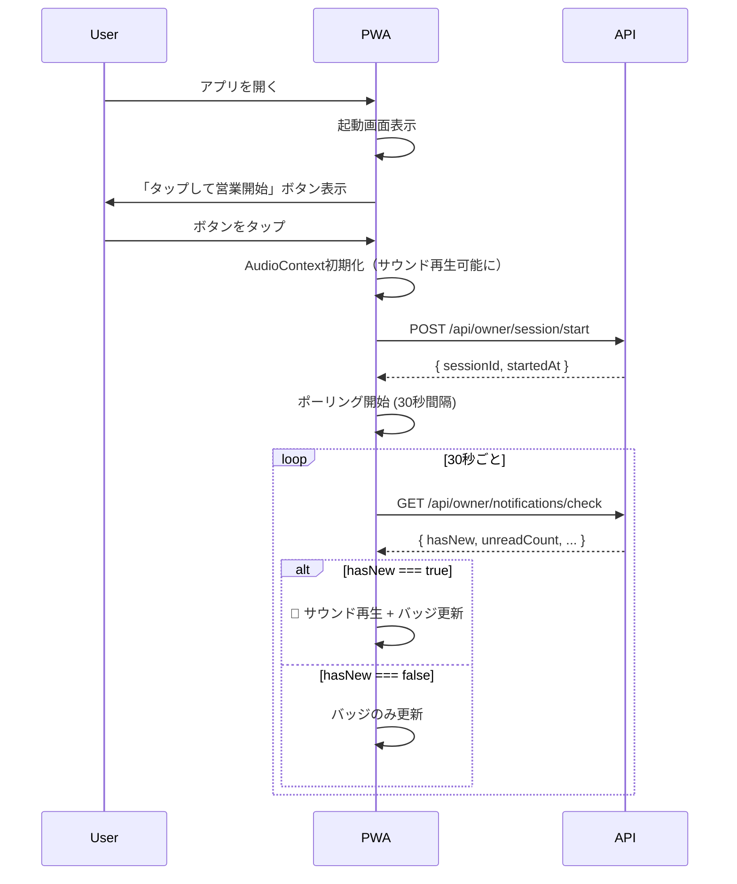

# DSGN-002: PWA Polling API & 通知ロジック仕様書

> **Ticket ID**: DSGN-002  
> **Title**: [Spec] Define PWA Polling API & Notification Logic  
> **作成日**: 2025-12-12  
> **担当**: Developer A (Lead) / Developer B (Reviewer)  
> **依存**: DSGN-001 完了後/並行

---

## 1. 概要

PWA Frontend (Developer B) が Backend (Developer A) を待たずに通知UIを構築できるよう、以下を定義します：

1. **Polling Endpoint** - 新規予約チェックAPI
2. **Response JSON Structure** - サウンド・ビジュアルアラートのトリガーフラグ
3. **Business Start Logic** - アプリ起動時のステータスリセット

---

## 2. エンドポイント定義

### 2.1 新規予約チェックAPI

```
GET /api/owner/notifications/check
```

| 項目 | 値 |
|-----|-----|
| **Method** | GET |
| **URL** | `/api/owner/notifications/check` |
| **Auth** | Bearer JWT Token (必須) |
| **Content-Type** | application/json |

#### リクエストヘッダー

```http
Authorization: Bearer <JWT_TOKEN>
X-Store-ID: <store_documentId>
```

> [!NOTE]
> `X-Store-ID` は店主が複数店舗を管理する場合に必要です。単一店舗の場合はJWTから取得可能。

#### クエリパラメータ

| パラメータ | 型 | 必須 | 説明 |
|-----------|---|-----|------|
| `since` | ISO8601 datetime | - | この時刻以降の予約のみ取得（デフォルト: 最終確認時刻） |

---

### 2.2 レスポンス構造

#### 成功時 (200 OK)

```json
{
  "success": true,
  "data": {
    "hasNew": true,
    "unreadCount": 3,
    "requiresAttention": 1,
    "latestReservation": {
      "id": "abc123",
      "reservationNumber": "R-20251212-A001",
      "guestName": "山田太郎",
      "date": "2025-12-25",
      "time": "19:00",
      "guests": 4,
      "status": "pending",
      "hasNotes": true,
      "createdAt": "2025-12-12T03:40:00.000Z"
    },
    "summary": {
      "pendingCount": 3,
      "todayCount": 5,
      "tomorrowCount": 2
    }
  },
  "meta": {
    "checkedAt": "2025-12-12T03:43:00.000Z",
    "nextPollInterval": 30000
  }
}
```

#### フィールド説明

| フィールド | 型 | 説明 |
|-----------|---|------|
| `hasNew` | boolean | **サウンドアラートトリガー**: 前回チェック以降に新規予約あり |
| `unreadCount` | integer | 未確認の予約件数（バッジ表示用） |
| `requiresAttention` | integer | 備考欄に要確認内容がある予約件数（⚠️アイコン用） |
| `latestReservation` | object | 最新の予約情報（プレビュー表示用） |
| `summary.pendingCount` | integer | 仮受付(pending)の予約総数 |
| `summary.todayCount` | integer | 今日の予約件数 |
| `summary.tomorrowCount` | integer | 明日の予約件数 |
| `meta.nextPollInterval` | integer | 推奨ポーリング間隔（ミリ秒） |

> [!IMPORTANT]
> **サウンド再生条件**: `hasNew === true` の場合のみサウンドを再生。
> **ビジュアル更新条件**: `unreadCount > 0` の場合にバッジ表示。

#### 新規予約なし (200 OK)

```json
{
  "success": true,
  "data": {
    "hasNew": false,
    "unreadCount": 0,
    "requiresAttention": 0,
    "latestReservation": null,
    "summary": {
      "pendingCount": 0,
      "todayCount": 3,
      "tomorrowCount": 1
    }
  },
  "meta": {
    "checkedAt": "2025-12-12T03:43:00.000Z",
    "nextPollInterval": 30000
  }
}
```

#### 認証エラー (401 Unauthorized)

```json
{
  "success": false,
  "error": {
    "code": "UNAUTHORIZED",
    "message": "認証が必要です"
  }
}
```

#### サーバーエラー (500)

```json
{
  "success": false,
  "error": {
    "code": "INTERNAL_ERROR",
    "message": "サーバーエラーが発生しました"
  }
}
```

---

## 3. 既読マークAPI

### 3.1 エンドポイント

```
POST /api/owner/notifications/mark-read
```

#### リクエストボディ

```json
{
  "reservationIds": ["abc123", "def456"],
  "markAll": false
}
```

| フィールド | 型 | 説明 |
|-----------|---|------|
| `reservationIds` | string[] | 既読にする予約ID配列 |
| `markAll` | boolean | `true`の場合、全予約を既読に |

#### レスポンス (200 OK)

```json
{
  "success": true,
  "data": {
    "markedCount": 2,
    "remainingUnread": 1
  }
}
```

---

## 4. Business Start Logic（アプリ起動ロジック）

> [!CAUTION]
> ブラウザのオーディオポリシーにより、**ユーザー操作なしにサウンドを再生できません**。
> 初回起動時に「タップして開始」UIを表示する必要があります。

### 4.1 起動フロー



### 4.2 セッション開始API

```
POST /api/owner/session/start
```

#### リクエストボディ

```json
{
  "deviceId": "device-uuid-12345",
  "platform": "pwa-ios"
}
```

#### レスポンス (200 OK)

```json
{
  "success": true,
  "data": {
    "sessionId": "session-abc123",
    "startedAt": "2025-12-12T03:43:00.000Z",
    "lastCheckedAt": null
  }
}
```

> [!TIP]
> `sessionId` はポーリング時に `hasNew` を正しく判定するために使用します。
> サーバー側で「このセッション以降に作成された予約」を追跡できます。

### 4.3 セッション終了API

```
POST /api/owner/session/end
```

#### リクエストボディ

```json
{
  "sessionId": "session-abc123"
}
```

---

## 5. ポーリング戦略

### 5.1 推奨設定

| 状態 | ポーリング間隔 | 説明 |
|-----|--------------|------|
| **アクティブ** | 30秒 | アプリがフォアグラウンド |
| **バックグラウンド** | 60秒 | アプリが非表示 |
| **低電力モード** | 120秒 | バッテリー残量低下時 |
| **エラー時** | 指数バックオフ | 30s → 60s → 120s → 300s |

### 5.2 Visibility API連携

```javascript
// Developer B 実装例
document.addEventListener('visibilitychange', () => {
  if (document.hidden) {
    pollInterval = 60000; // バックグラウンド
  } else {
    pollInterval = 30000; // フォアグラウンド
    checkNotifications(); // 即時チェック
  }
});
```

---

## 6. PWA通知UI仕様

### 6.1 ビジュアル要素

| 要素 | 条件 | 表示内容 |
|-----|-----|---------|
| **バッジ** | `unreadCount > 0` | 未読件数（最大 "99+"） |
| **⚠️アイコン** | `requiresAttention > 0` | 要確認予約あり |
| **プレビュー** | `latestReservation != null` | 「山田太郎様 19:00 4名」 |
| **サウンド** | `hasNew === true` + セッション開始済み | 通知音再生 |

### 6.2 サウンドファイル

| ファイル | 用途 | 再生条件 |
|---------|-----|---------|
| `notification.mp3` | 新規予約 | `hasNew === true` |
| `attention.mp3` | 要確認予約 | `requiresAttention > 0` (オプション) |

---

## 7. エラーハンドリング

### 7.1 フロントエンド対応

| エラー | 対応 |
|-------|------|
| 401 Unauthorized | ログイン画面へリダイレクト |
| 429 Too Many Requests | ポーリング間隔を2倍に |
| 500 Internal Error | エラーバナー表示 + リトライ |
| Network Error | オフラインバナー表示 |

---

## 8. 型定義 (TypeScript)

```typescript
// Developer B が使用する型定義

interface NotificationCheckResponse {
  success: boolean;
  data: {
    hasNew: boolean;
    unreadCount: number;
    requiresAttention: number;
    latestReservation: LatestReservation | null;
    summary: {
      pendingCount: number;
      todayCount: number;
      tomorrowCount: number;
    };
  };
  meta: {
    checkedAt: string; // ISO8601
    nextPollInterval: number; // milliseconds
  };
}

interface LatestReservation {
  id: string;
  reservationNumber: string;
  guestName: string;
  date: string; // YYYY-MM-DD
  time: string; // HH:mm
  guests: number;
  status: 'pending' | 'confirmed' | 'rejected' | 'cancelled' | 'no_show';
  hasNotes: boolean;
  createdAt: string; // ISO8601
}

interface SessionStartResponse {
  success: boolean;
  data: {
    sessionId: string;
    startedAt: string;
    lastCheckedAt: string | null;
  };
}
```

---

## 9. モックサーバー仕様

> [!TIP]
> Developer B はバックエンド完成前にこのモックデータで開発を進められます。

### 9.1 モックレスポンス例

```javascript
// mock-api.js
const mockNotificationCheck = {
  success: true,
  data: {
    hasNew: Math.random() > 0.7, // 30%の確率で新規予約
    unreadCount: Math.floor(Math.random() * 5),
    requiresAttention: Math.floor(Math.random() * 2),
    latestReservation: {
      id: 'mock-001',
      reservationNumber: 'R-20251212-M001',
      guestName: 'テスト太郎',
      date: '2025-12-25',
      time: '19:00',
      guests: 4,
      status: 'pending',
      hasNotes: true,
      createdAt: new Date().toISOString()
    },
    summary: {
      pendingCount: 3,
      todayCount: 5,
      tomorrowCount: 2
    }
  },
  meta: {
    checkedAt: new Date().toISOString(),
    nextPollInterval: 30000
  }
};
```

---

## 10. 承認チェックリスト

### Developer B 確認事項

- [ ] ポーリングエンドポイント仕様が明確
- [ ] レスポンスJSONからUI構築が可能
- [ ] サウンド再生トリガー条件が明確
- [ ] Business Start Logic（タップして開始）の実装方法が理解できる
- [ ] TypeScript型定義が使用可能
- [ ] モックサーバーで開発開始可能

### 署名

| 役割 | 名前 | 日付 | 署名 |
|-----|-----|------|-----|
| Developer A (Lead) | | | |
| Developer B (Reviewer) | | | |

---

## 11. 変更履歴

| バージョン | 日付 | 変更内容 | 担当者 |
|-----------|------|---------|--------|
| 1.0 | 2025-12-12 | 初版作成 | Developer A |
