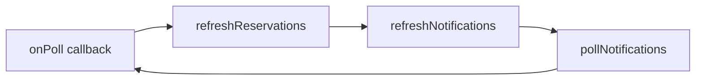

# APIポーリング無限ループ問題の修正計画

## 問題の概要

サーバー再起動時にフロントエンドがAPIを50-60msごとに連続して呼び出し、無限ループ状態になる問題が発生。

### 発見された循環参照



**具体的なコードフロー：**
1. `DashboardClient.tsx:91-93`: `onPoll` コールバックが `refreshReservations()` を呼び出す
2. `DashboardClient.tsx:101`: `refreshReservations()` 内で `refreshNotifications()` を呼び出す
3. `usePWANotifications.ts:276`: `refreshNotifications` は `pollNotifications(true)` を呼び出す
4. `usePWANotifications.ts:185-187`: `pollNotifications` の最後で `onPoll()` コールバックを呼び出す
5. → 1に戻る（無限ループ）

## 提案する修正

### [MODIFY] [DashboardClient.tsx](file:///e:/15.app_sumaho_uketsuke/frontend/components/admin/DashboardClient.tsx)

`refreshReservations` 関数から `refreshNotifications()` の呼び出しを削除する。

**理由：**
- `refreshNotifications` は既に `onPoll` を通じて定期的に呼ばれている
- 予約データの更新と通知の更新は独立した処理であるべき
- `onPoll` が呼ばれた時点で通知は既に更新済み

```diff
    // 予約データの再取得（通知も更新）
    const refreshReservations = useCallback(async () => {
        if (store?.documentId) {
            const updated = await getReservations(store.documentId);
            setReservations(updated);
-           refreshNotifications(); // バッジも即時更新
        }
-   }, [store?.documentId, refreshNotifications]);
+   }, [store?.documentId]);
```

---

## 検証計画

### 手動検証

1. **バックエンドサーバーを起動**
   ```powershell
   cd e:\15.app_sumaho_uketsuke\backend
   npm run develop
   ```

2. **フロントエンドサーバーを起動**
   ```powershell
   cd e:\15.app_sumaho_uketsuke\frontend
   npm run dev
   ```

3. **ブラウザでダッシュボードを開く**
   - `http://localhost:3000/admin/dashboard` にアクセス
   - 開発者ツール（F12）のNetworkタブを開く

4. **ループが発生しないことを確認**
   - APIリクエストが60秒間隔で発生することを確認
   - 50-60msごとの連続リクエストが発生しないことを確認

5. **サーバーログを確認**
   - バックエンドのターミナルで、リクエストが60秒間隔であることを確認

