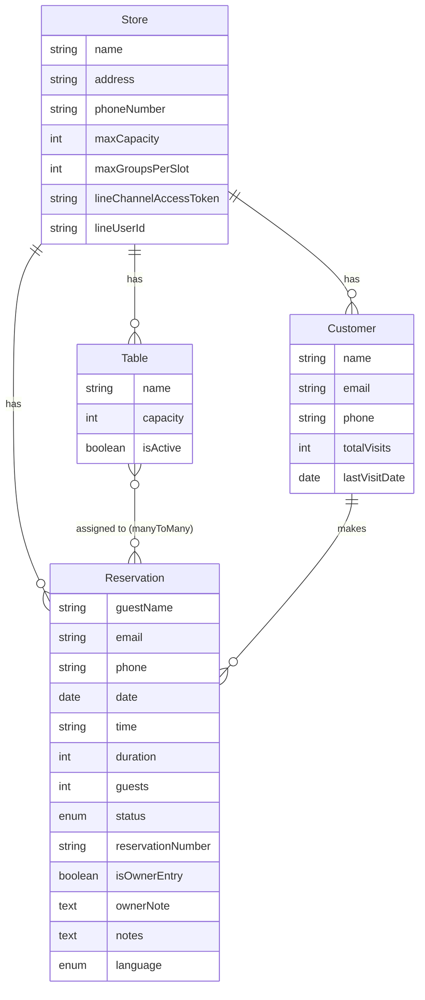

# DSGN-001: データベーススキーマ & メールテンプレート変数 定義書

> **Ticket ID**: DSGN-001  
> **Title**: [Spec] Define Database Schema & Email Template Variables  
> **作成日**: 2025-12-12  
> **担当**: Developer A (Lead) / Developer C (Reviewer)

---

## 1. 概要

Backend（Developer A）とEmail/Infra（Developer C）が並行作業できるよう、以下を定義します：

1. **Reservation Collection** - 予約情報（詳細モード対応）
2. **Table Collection** - テーブル/席情報
3. **Customer Collection** - 顧客情報（CRM用）
4. **Email Template Variables** - メールテンプレートで使用する変数

---

## 2. Reservation Collection（予約情報）

> [!IMPORTANT]
> Day 1から詳細モード（テーブル管理）をサポートする設計です。

### 2.1 フィールド定義

| フィールド名 | 型 | 必須 | デフォルト | 説明 |
|------------|----|----|----------|------|
| `guestName` | text | ✅ | - | ゲスト名 |
| `email` | email | 🔺 | - | 連絡用メールアドレス（※備考参照） |
| `phone` | string | - | - | 連絡先電話番号 |
| `date` | date (ISO 8601) | ✅ | - | 予約日（例: `2025-12-25`） |
| `time` | string | ✅ | - | 予約開始時間（例: `18:00`） |
| `duration` | integer | - | `120` | 所要時間（分）。在庫計算に使用（min: 15） |
| `guests` | integer | ✅ | - | 人数（min: 1） |
| `status` | enumeration | ✅ | `pending` | 予約ステータス |
| `assignedTables` | relation | - | - | 割当テーブル（Table → **manyToMany**） |
| `reservationNumber` | string (unique) | - | - | 予約番号（例: `R-20251212-A001`） |
| `isOwnerEntry` | boolean | - | `false` | 店主による手動入力フラグ |
| `ownerNote` | text | - | - | 店主用内部メモ |
| `customer` | relation | - | - | 顧客マスタ（Customer → manyToOne） |
| `notes` | text | - | - | ゲストからの要望・備考 |
| `course` | string | - | - | 選択コース名 |
| `language` | enumeration | - | `ja` | 希望言語 |
| `ownerReply` | text | - | - | 店主からの返信メッセージ |
| `requiresAttention` | boolean | - | `false` | 要確認フラグ（備考欄にAI検出の要望あり等） |
| `store` | relation | ✅ | - | 所属店舗（Store → manyToOne） |

> [!WARNING]
> **email フィールドの必須条件**
> - DB レベルでは `required: false`（店主による電話予約入力のため）
> - **API バリデーション**で「`isOwnerEntry` が `false` なら `email` は必須」を実装すること

### 2.2 duration フィールドについて

> [!IMPORTANT]
> `duration` は在庫管理（回転率計算）の根幹です。
> `time` + `duration` により「何時に席が空くか」を算出し、次枠の予約可否を判定します。

### 2.3 Status Enum 定義

> [!CAUTION]
> `status` フィールドは予約フローの根幹です。以下の値を厳守してください。

| 値 | 日本語 | 説明 |
|---|--------|------|
| `pending` | 仮受付 | 予約申請受付、店主確認待ち |
| `confirmed` | 確定 | 店主承認済み、確定メール送信対象 |
| `rejected` | 拒否 | 店主がキャンセル（満席等） |
| `cancelled` | キャンセル | ゲストによるキャンセル |
| `no_show` | ノーショー | 来店なし記録 |

### 2.4 Language Enum 定義

| 値 | 言語 |
|---|------|
| `ja` | 日本語 |
| `en` | 英語 |
| `zh` | 中国語（簡体字） |
| `ko` | 韓国語 |

### 2.5 Strapi Schema JSON

```json
{
    "kind": "collectionType",
    "collectionName": "reservations",
    "info": {
        "singularName": "reservation",
        "pluralName": "reservations",
        "displayName": "Reservation",
        "description": "予約情報（詳細モード対応）"
    },
    "options": {
        "draftAndPublish": false
    },
    "pluginOptions": {},
    "attributes": {
        "guestName": {
            "type": "string",
            "required": true
        },
        "email": {
            "type": "email"
        },
        "phone": {
            "type": "string"
        },
        "date": {
            "type": "date",
            "required": true
        },
        "time": {
            "type": "string",
            "required": true
        },
        "duration": {
            "type": "integer",
            "default": 120,
            "min": 15
        },
        "guests": {
            "type": "integer",
            "required": true,
            "min": 1
        },
        "status": {
            "type": "enumeration",
            "enum": ["pending", "confirmed", "rejected", "cancelled", "no_show"],
            "default": "pending",
            "required": true
        },
        "assignedTables": {
            "type": "relation",
            "relation": "manyToMany",
            "target": "api::table.table",
            "inversedBy": "reservations"
        },
        "reservationNumber": {
            "type": "string",
            "unique": true
        },
        "isOwnerEntry": {
            "type": "boolean",
            "default": false
        },
        "ownerNote": {
            "type": "text"
        },
        "customer": {
            "type": "relation",
            "relation": "manyToOne",
            "target": "api::customer.customer",
            "inversedBy": "reservations"
        },
        "notes": {
            "type": "text"
        },
        "course": {
            "type": "string"
        },
        "language": {
            "type": "enumeration",
            "enum": ["ja", "en", "zh", "ko"],
            "default": "ja"
        },
        "ownerReply": {
            "type": "text"
        },
        "requiresAttention": {
            "type": "boolean",
            "default": false
        },
        "store": {
            "type": "relation",
            "relation": "manyToOne",
            "target": "api::store.store",
            "inversedBy": "reservations"
        }
    }
}
```

---

## 3. Table Collection（テーブル/席情報）

> [!NOTE]
> 詳細モード（テーブル管理）で使用。店舗ごとにテーブル/席を定義します。

### 3.1 フィールド定義

| フィールド名 | 型 | 必須 | デフォルト | 説明 |
|------------|----|----|----------|------|
| `name` | string | ✅ | - | テーブル名（例: "テーブルA", "カウンター1"） |
| `capacity` | integer | ✅ | - | 着席可能人数（min: 1） |
| `description` | text | - | - | 備考（窓際、個室等） |
| `isActive` | boolean | - | `true` | 利用可能フラグ |
| `store` | relation | ✅ | - | 所属店舗（Store → manyToOne） |
| `reservations` | relation | - | - | 予約履歴（Reservation → **manyToMany**） |

### 3.2 Strapi Schema JSON

```json
{
    "kind": "collectionType",
    "collectionName": "tables",
    "info": {
        "singularName": "table",
        "pluralName": "tables",
        "displayName": "Table",
        "description": "店舗のテーブル/席情報"
    },
    "options": {
        "draftAndPublish": false
    },
    "pluginOptions": {},
    "attributes": {
        "name": {
            "type": "string",
            "required": true
        },
        "capacity": {
            "type": "integer",
            "required": true,
            "min": 1
        },
        "description": {
            "type": "text"
        },
        "isActive": {
            "type": "boolean",
            "default": true
        },
        "store": {
            "type": "relation",
            "relation": "manyToOne",
            "target": "api::store.store",
            "inversedBy": "tables"
        },
        "reservations": {
            "type": "relation",
            "relation": "manyToMany",
            "target": "api::reservation.reservation",
            "mappedBy": "assignedTables"
        }
    }
}
```

---

## 4. Customer Collection（顧客情報）

> [!NOTE]
> CRM機能の基盤。予約履歴を顧客単位で集約できます。

### 4.1 フィールド定義

| フィールド名 | 型 | 必須 | デフォルト | 説明 |
|------------|----|----|----------|------|
| `name` | string | ✅ | - | 顧客名 |
| `email` | email | - | - | メールアドレス（重複チェック用） |
| `phone` | string | - | - | 電話番号 |
| `notes` | text | - | - | 顧客メモ（アレルギー情報等） |
| `totalVisits` | integer | - | `0` | 累計来店回数 |
| `lastVisitDate` | date | - | - | 最終来店日 |
| `reservations` | relation | - | - | 予約履歴（Reservation → oneToMany） |
| `store` | relation | ✅ | - | 所属店舗（Store → manyToOne） |

### 4.2 Strapi Schema JSON

```json
{
    "kind": "collectionType",
    "collectionName": "customers",
    "info": {
        "singularName": "customer",
        "pluralName": "customers",
        "displayName": "Customer",
        "description": "顧客マスタ（CRM用）"
    },
    "options": {
        "draftAndPublish": false
    },
    "pluginOptions": {},
    "attributes": {
        "name": {
            "type": "string",
            "required": true
        },
        "email": {
            "type": "email"
        },
        "phone": {
            "type": "string"
        },
        "notes": {
            "type": "text"
        },
        "totalVisits": {
            "type": "integer",
            "default": 0,
            "min": 0
        },
        "lastVisitDate": {
            "type": "date"
        },
        "reservations": {
            "type": "relation",
            "relation": "oneToMany",
            "target": "api::reservation.reservation",
            "mappedBy": "customer"
        },
        "store": {
            "type": "relation",
            "relation": "manyToOne",
            "target": "api::store.store",
            "inversedBy": "customers"
        }
    }
}
```

---

## 5. Store Collection 追加フィールド

> [!IMPORTANT]
> 既存の Store スキーマに以下のリレーションを追加する必要があります。

```json
{
    "reservations": {
        "type": "relation",
        "relation": "oneToMany",
        "target": "api::reservation.reservation",
        "mappedBy": "store"
    },
    "tables": {
        "type": "relation",
        "relation": "oneToMany",
        "target": "api::table.table",
        "mappedBy": "store"
    },
    "customers": {
        "type": "relation",
        "relation": "oneToMany",
        "target": "api::customer.customer",
        "mappedBy": "store"
    }
}
```

### 5.1 LINE通知設定（推奨追加）

> [!TIP]
> 店主ごとのLINE通知（朋200通制限回避プラン）機能のためのフィールドです。

```json
{
    "lineChannelAccessToken": {
        "type": "text",
        "private": true
    },
    "lineUserId": {
        "type": "string",
        "private": true
    }
}
```

---

## 6. Email Template Variables（メールテンプレート変数）

> [!TIP]
> Developer C はこれらの変数を使用してHTMLメールテンプレートを作成してください。

### 6.1 予約関連変数

| 変数名 | 型 | 説明 | 例 |
|--------|---|------|-----|
| `{{ reservation.guestName }}` | string | ゲスト名 | 山田太郎 |
| `{{ reservation.email }}` | string | メールアドレス | yamada@example.com |
| `{{ reservation.phone }}` | string | 電話番号 | 090-1234-5678 |
| `{{ reservation.date }}` | date | 予約日（ISO形式） | 2025-12-25 |
| `{{ reservation.dateFormatted }}` | string | 予約日（表示用） | 12月25日（木） |
| `{{ reservation.time }}` | string | 予約時間 | 18:00 |
| `{{ reservation.guests }}` | integer | 人数 | 4 |
| `{{ reservation.status }}` | string | ステータス | pending |
| `{{ reservation.statusLabel }}` | string | ステータス（日本語） | 仮受付 |
| `{{ reservation.course }}` | string | コース名 | 忘年会コース |
| `{{ reservation.notes }}` | string | ゲスト備考 | アレルギーあり |
| `{{ reservation.ownerReply }}` | string | 店主メッセージ | ご予約ありがとうございます |
| `{{ reservation.language }}` | string | 言語コード | ja |

### 6.2 テーブル関連変数

> [!NOTE]
> `assignedTables` は **manyToMany** のため、配列としてアクセスします。

| 変数名 | 型 | 説明 | 例 |
|--------|---|------|-----|
| `{{ reservation.assignedTables }}` | array | 割当テーブル配列 | [テーブルA, テーブルB] |
| `{{ reservation.assignedTables[0].name }}` | string | 1番目のテーブル名 | テーブルA |
| `{{ reservation.assignedTablesText }}` | string | テーブル名一覧（カンマ区切り） | テーブルA, テーブルB |
| `{{ reservation.duration }}` | integer | 所要時間（分） | 120 |
| `{{ reservation.reservationNumber }}` | string | 予約番号 | R-20251212-A001 |

### 6.3 店舗関連変数

| 変数名 | 型 | 説明 | 例 |
|--------|---|------|-----|
| `{{ store.name }}` | string | 店舗名 | レストラン青空 |
| `{{ store.address }}` | string | 住所 | 東京都渋谷区... |
| `{{ store.phoneNumber }}` | string | 店舗電話番号 | 03-1234-5678 |
| `{{ store.description }}` | string | 店舗説明 | 創業30年の老舗 |
| `{{ store.businessHours }}` | object | 営業時間情報 | JSON形式 |

### 6.4 顧客関連変数

| 変数名 | 型 | 説明 | 例 |
|--------|---|------|-----|
| `{{ customer.name }}` | string | 顧客名 | 山田太郎 |
| `{{ customer.totalVisits }}` | integer | 累計来店回数 | 5 |
| `{{ customer.lastVisitDate }}` | date | 最終来店日 | 2025-11-01 |

### 6.5 システム変数

| 変数名 | 型 | 説明 | 例 |
|--------|---|------|-----|
| `{{ confirmationUrl }}` | string | 予約確認URL | https://... |
| `{{ cancellationUrl }}` | string | キャンセルURL | https://... |
| `{{ currentYear }}` | integer | 現在年 | 2025 |

---

## 7. メールテンプレート種別

### 7.1 必須テンプレート（Phase 1）

| テンプレートID | 名称 | トリガー |
|--------------|------|---------|
| `reservation_pending` | 仮受付完了通知 | 予約作成 (status: pending) |
| `reservation_confirmed` | 予約確定通知 | status → confirmed |
| `reservation_rejected` | 予約キャンセル通知 | status → rejected |
| `reservation_cancelled` | キャンセル受付通知 | ゲストによるキャンセル |

### 7.2 追加テンプレート（Phase 2）

| テンプレートID | 名称 | トリガー |
|--------------|------|---------|
| `reservation_reminder` | リマインダー | 予約日前日 |
| `owner_new_reservation` | 店主向け新規予約通知 | 予約作成 |
| `owner_cancellation` | 店主向けキャンセル通知 | ゲストキャンセル |

---

## 8. ER図



---

## 9. 承認チェックリスト

### Developer C 確認事項

- [ ] Reservation フィールド定義が理解できる
- [ ] Email Template Variables でテンプレート作成が可能
- [ ] Status Enum の5種類の意味が明確
- [ ] 多言語対応（ja/en/zh/ko）の対応可能
- [ ] テーブル割当変数（`assignedTables`, `assignedTablesText`）の使用方法が明確

### 署名

| 役割 | 名前 | 日付 | 署名 |
|-----|-----|------|-----|
| Developer A (Lead) | | | |
| Developer C (Reviewer) | | | |

---

## 10. 変更履歴

| バージョン | 日付 | 変更内容 | 担当者 |
|-----------|------|---------|--------|
| 1.0 | 2025-12-12 | 初版作成 | Developer A |
| 1.1 | 2025-12-12 | `duration` フィールド追加、`assignedTables` manyToMany化、LINE設定・予約番号追加、email必須条件備考追加 | Developer A |
