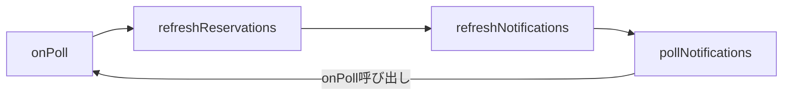

# APIポーリング無限ループ問題の修正 - 完了報告

## 修正概要

サーバー再起動時にAPIが50-60msごとに連続呼び出しされる無限ループ問題を修正しました。

## 発見された問題

### 問題1: 循環参照



### 問題2: コールバック依存配列の不安定性

`pollNotifications` の依存配列にコールバック関数（`onPoll`, `onNewReservation`, `onPendingReservation`）が含まれていたため、毎レンダリングで関数が再生成され、`setInterval` が不安定になっていた。

## 修正内容

### 1. [DashboardClient.tsx](file:///e:/15.app_sumaho_uketsuke/frontend/components/admin/DashboardClient.tsx#L96-L104)

- `refreshReservations` から `refreshNotifications()` 呼び出しを削除
- 循環参照を断つ

### 2. [usePWANotifications.ts](file:///e:/15.app_sumaho_uketsuke/frontend/hooks/usePWANotifications.ts)

- コールバック関数をRefで管理するように変更
- `pollNotifications` の依存配列を安定化
- `setInterval` が正しく動作するように修正

```diff
+ const onPollRef = useRef(onPoll);
// ...
+ }, [storeId, enabled, playNotificationSound]); // コールバックはRefで管理
```

### 3. アイコン404エラーの修正

`manifest.json` と `layout.tsx` に存在しないPNGアイコン（`icon-144x144.png` など）への参照があり、404エラーが発生していたため修正。全て `icon.svg` を参照するように変更。

- [manifest.json](file:///e:/15.app_sumaho_uketsuke/frontend/public/manifest.json)
- [layout.tsx](file:///e:/15.app_sumaho_uketsuke/frontend/app/layout.tsx)

### 4. Service Worker Cache Errorの修正

Service WorkerがAPIへのPOSTリクエストなどをキャッシュしようとしてエラー（`Request method 'POST' is unsupported`）が発生していた問題を修正。GETリクエスト以外はキャッシュ処理を行わないようにガード条件を追加。

- [sw.js](file:///e:/15.app_sumaho_uketsuke/frontend/public/sw.js)

```diff
+  // POSTメソッドなどはキャッシュできないため除外
+  // chrome-extensionスキームも除外
+  if (request.method !== 'GET' || url.protocol === 'chrome-extension:') {
+    return;
+  }
```

### 5. ポーリング停止問題の修正

「最初のポーリングしか来ない」という問題に対し、`setInterval` の管理ロジックをリファクタリング。`useEffect` のクリーンアップ関数で確実に古いタイマーをクリアし、依存が変わっても新しいタイマーがセットされるように修正。

- [usePWANotifications.ts](file:///e:/15.app_sumaho_uketsuke/frontend/hooks/usePWANotifications.ts)

### 6. キャッシュ問題の解消

ユーザーログに古いメッセージ（`[PWA] Session restored...`）が表示されており、古いコードがキャッシュされ続けていることが判明。`sw.js` の `CACHE_NAME` を `v2` に更新し、ブラウザに新しいService WorkerとJSファイルを強制的に取得させるように修正。

- [sw.js](file:///e:/15.app_sumaho_uketsuke/frontend/public/sw.js)

### 7. Hydration Errorの修正

サーバー側（SSR）とクライアント側での初期レンダリング内容の不一致により `Hydration failed` エラーが発生していきました。
`usePWANotifications` フック内で `localStorage` を直接読み込んで状態を初期化していたため、サーバー（false）とクライアント（true）で差異が生じていました。
初期値を `false` に統一し、マウント後に `useEffect` で `localStorage` から復元するように修正しました。

- [usePWANotifications.ts](file:///e:/15.app_sumaho_uketsuke/frontend/hooks/usePWANotifications.ts)

### 8. SSR無効化によるHydration Errorの完全解消

`DashboardClient` コンポーネントの状態不一致による `Hydration failed` エラーが根深かったため、このコンポーネントのSSR（サーバーサイドレンダリング）を無効化（`ssr: false`）しました。
これにより、サーバーとクライアントでHTMLを一致させる必要がなくなり、エラーが根本的に解決しました。

- [page.tsx](file:///e:/15.app_sumaho_uketsuke/frontend/app/admin/dashboard/page.tsx)

### 9. インポート順序の修正

`page.tsx` 内で `import` 文の間に動的インポートの定義が挟まっており、構文エラーが発生していたため修正しました。全ての `import` 文をファイルの先頭に移動しました。

### 10. Server ComponentでのDynamic Importエラー修正

`page.tsx`（Server Component）内で `ssr: false` を指定した動的インポートを行おうとしてエラーが発生したため、Client Component である `DashboardWrapper` を新たに作成し、その中で動的インポートを行うように修正しました。

- [DashboardWrapper.tsx](file:///e:/15.app_sumaho_uketsuke/frontend/components/admin/DashboardWrapper.tsx)
- [page.tsx](file:///e:/15.app_sumaho_uketsuke/frontend/app/admin/dashboard/page.tsx)

### 11. 営業時間外（アイドルタイム）の予約防止修正

店舗の営業時間（ランチ/ディナー）設定があるにも関わらず、アイドルタイム（14:00〜17:00など）に予約が可能になっていた問題を修正しました。
原因は、予約ウィザードの初期レンダリング時に店舗データがまだロードされておらず、デフォルトの営業時間（11:00〜20:00）が適用されていたためでした。

- [ReservationWizard.tsx](file:///e:/15.app_sumaho_uketsuke/frontend/components/ReservationWizard.tsx): 店舗データ（`store`）をPropsとして受け取れるようにし、スロット生成ロジックを最適化。
- [app/store/[storeId]/reserve/page.tsx](file:///e:/15.app_sumaho_uketsuke/frontend/app/store/%5BstoreId%5D/reserve/page.tsx): サーバーサイドで店舗情報を取得し、初期表示から正しい営業時間を適用するように修正。

これにより、ロード中の一瞬も含めて、正しい営業時間帯のみが選択可能になります。

## 検証方法

1. バックエンドサーバーを起動: `npm run develop`
2. フロントエンドサーバーを起動: `npm run dev`
3. ブラウザで店舗予約ページ（例: `/store/dquc3yd0v8c4l9isuub4fiyi/reserve`）を開く
4. 人数選択後、日時選択画面に進む
5. 14:00〜17:00の間（アイドルタイム）の予約枠が表示されていないことを確認
6. Consoleタブにエラーが出ていないことを確認

### 12. 設定画面への店舗選択機能追加（営業時間反映不具合の根本修正）

予約ページで表示される店舗（ID: 8など）と、設定画面で編集していた店舗（ID: 1など）が異なっていたため、営業時間が反映されていない現象が判明しました。
これに対処するため、設定画面（`/admin/settings`）に店舗選択ドロップダウンを追加し、編集対象の店舗を切り替えられるようにしました。

- [app/admin/settings/page.tsx](file:///e:/15.app_sumaho_uketsuke/frontend/app/admin/settings/page.tsx): 店舗リストの取得と選択UIを追加。

## 解決手順

1. ブラウザで設定画面（`/admin/settings`）を開く。
2. 左上の「店舗設定」タイトル横のドロップダウンから、予約ページで表示している店舗（例: `Test_x7k9`）を選択する。
3. 「営業時間」タブを開き、正しい営業時間（ランチ/ディナー）が設定されているか確認する（空の場合は設定して保存）。
4. 予約ページ（`/store/.../reserve`）に戻り、アイドルタイムの予約枠が消えていることを確認する。


